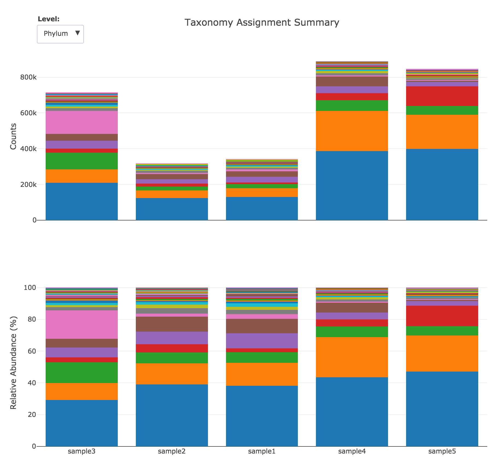

# relatively

Handles parsing of hierarchy-associated quantities to generate a single plot
object (a Plotly figure) with a subplot of counts and one for relative
abundance.

# Example
[](https://mybinder.org/v2/gh/brwnj/relatively/master?filepath=notebooks%2Fexample.ipynb)

# Install

Python >= 3.6.

```
pip install relatively
```

# Usage

```
import relatively
import plotly

fig = relatively.abundance_figure("taxonomy.txt",
    ["phylum", "class", "order"],
    title="Taxonomy Assignment Summary")
plotly.offline.iplot(fig)
```


